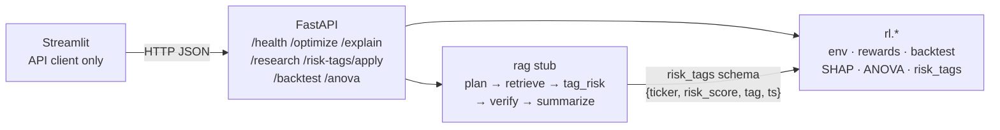

# Architecture (week-38)

Educational demo only — not investment advice. Backtests ≠ future returns.

Short map of how the Streamlit UI, FastAPI surface, RL package, and RAG stub fit together for Notion week-38.

## Request path

## Layers

| Layer | Role | Key paths |
|---|---|---|
| UI | Dashboard tabs; **no local model load** — HTTP only | `streamlit_app/app.py` |
| API | Thin wrappers + Pydantic schemas; `stub: true` on educational paths | `api/main.py`, `api/schemas.py`, `api/services/` |
| RL | Gymnasium env, PPO training, metrics, stats, risk-tag panel | `rl/` |
| RAG | LangGraph-shaped stub (no LangGraph/Chroma deps yet) | `rag/graph.py`, `rag/store.py` |

## RAG node contract

`POST /research` runs a linear stub graph and returns:

- `node_trace`: ordered names `plan → retrieve → tag_risk → verify → summarize`
- `node_latencies_ms`: per-node wall times (stub timings; not production SLOs)
- `plan`, `citations`, `verify_ok` / `verify_notes`, `risk_tags`, `report_excerpt`
- always **`stub: true`** until a live LLM + Chroma path lands

Risk tags follow the env contract and feed `PortfolioEnv.portfolio_risk` via `POST /risk-tags/apply` (also stubbed).

## Related docs

- Notion checklist map: `docs/notion_submission_map.md`
- Morning review: `docs/morning_review.md`
- Reward rationale: `docs/reward_rationale.md`
- Error analysis (Colab numbers TBD): `docs/error_analysis.md`
- Report skeleton: `docs/report/outline.md`
